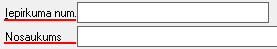

.. 679
 
Iepirkums
*************
 
:doc:`<678>`

Izvēloties dokumenta veidu Iepirkums, tiks atvērts jauns logs:

|images_ozols/25517.png|

1. Iepirkuma Virsraksta sadaļa
++++++++++++++++++++++++++++++

Iepirkuma Virsrakstā nepieciešams aizpildīt:

1. Rīkojuma datumu, kurā pieņemts lēmums par Iepirkuma procedūras
rezultātu un šī rīkojuma numuru:

|images_ozols/25518.png|

2. Iepirkumu procedūras rezultātā definēto iepirkuma numuru un
piešķirto Iepirkuma nosaukumu:

|images_ozols/25519.png|

3. Norādīt atbilstošo Iepirkuma procedūras veidu, kā rezultātā
Iepirkums ir izveidots:

|images_ozols/25520.png|

4. Nepieciešams norādīt Iepirkuma statusu - vai Iepirkums pašlaik ir
projekta stadijā, izpildīts, izpildīts, lauzts, utt.:

|images_ozols/25520.png|

5. Ievadīt Lēmuma, par iepirkuma procedūras rezultātā radušos
Ieprikuma, pieņemšanas datumu:

|images_ozols/25521.png|

2. Citi dati
++++++++++++

Sadaļā citi dati tiek aizpildīta informācija par pašu uzņēmumu -
Uzņēmuma nosaukums, kā arī iespējams noradīt Atbildīgo personu par šo
Iepirkumu, no uzņēmuma puses:

|images_ozols/25522.png|

PēcVirsraksta un Citu datuierakstu aizpildīšanas,Iepirkumu iespējams
|images_ozols/24615.jpg| vai |images_ozols/24617.jpg| .

Saglabātie ieraksti - pievienotie Ieprikumi, būs pieejams
apskatei/labošanai :doc:`Iepirkumu žurnālā<678>` .

.. |images_ozols/25517.png| image:: images_ozols/25517.png
       :scale: 100%

.. |images_ozols/25520.png| image:: images_ozols/25520.png
       :scale: 100%

.. |images_ozols/25520.png| image:: images_ozols/25520.png
       :scale: 100%

.. |images_ozols/25521.png| image:: images_ozols/25521.png
       :scale: 100%

.. |images_ozols/25522.png| image:: images_ozols/25522.png
       :scale: 100%

.. |images_ozols/24615.jpg| image:: images_ozols/24615.jpg
       :scale: 100%

.. |images_ozols/24617.jpg| image:: images_ozols/24617.jpg
       :scale: 100%


 
