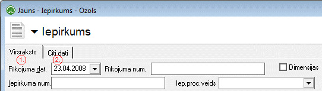
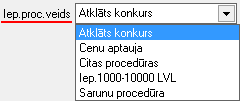
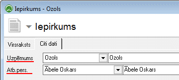

.. 679
 
Iepirkums
*************
 
:doc:`<678>`

Izvēloties dokumenta veidu Iepirkums, tiks atvērts jauns logs:

:scale: 100%

1. Iepirkuma Virsraksta sadaļa
++++++++++++++++++++++++++++++

Iepirkuma Virsrakstā nepieciešams aizpildīt:

1. Rīkojuma datumu, kurā pieņemts lēmums par Iepirkuma procedūras
rezultātu un šī rīkojuma numuru:

.. image:: images_ozols/25518.png
:scale: 100%

2. Iepirkumu procedūras rezultātā definēto iepirkuma numuru un
piešķirto Iepirkuma nosaukumu:

.. image:: images_ozols/25519.png
:scale: 100%

3. Norādīt atbilstošo Iepirkuma procedūras veidu, kā rezultātā
Iepirkums ir izveidots:

:scale: 100%

4. Nepieciešams norādīt Iepirkuma statusu - vai Iepirkums pašlaik ir
projekta stadijā, izpildīts, izpildīts, lauzts, utt.:

:scale: 100%

5. Ievadīt Lēmuma, par iepirkuma procedūras rezultātā radušos
Ieprikuma, pieņemšanas datumu:

.. image:: images_ozols/25521.png
:scale: 100%

2. Citi dati
++++++++++++

Sadaļā citi dati tiek aizpildīta informācija par pašu uzņēmumu -
Uzņēmuma nosaukums, kā arī iespējams noradīt Atbildīgo personu par šo
Iepirkumu, no uzņēmuma puses:

:scale: 100%

PēcVirsraksta un Citu datuierakstu aizpildīšanas,Iepirkumu iespējams
.. image:: images_ozols/24615.jpg
:scale: 100%
vai .. image:: images_ozols/24617.jpg
:scale: 100%
.

Saglabātie ieraksti - pievienotie Ieprikumi, būs pieejams
apskatei/labošanai :doc:`Iepirkumu žurnālā<678>` .


 
