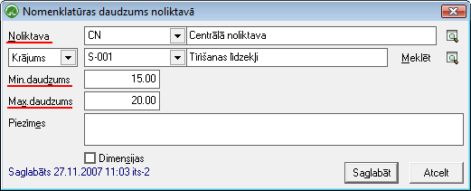
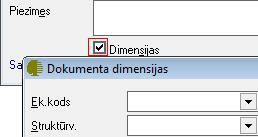

.. 689
 
Nomenklatūras daudzumi noliktavās
*************************************
 

Sarakstā iespējams jebkurai precei/krājumam nomenklatūras kartiņā
norādīt minimālu un maksimālo daudzuma atlikumu Noliktavā.

Lai nomenklatūras aprakstā norādītu minimālo un maksimālo daudzuma
atlikumu Noliktavā,rīku joslānepieciešams nospiest pogu
|images_ozols/24708.png| :

|images_ozols/25328.png|

Atzīmējot izvēles rūtiņu "Dimensijas", nomenklatūrasmin. un max.
daudzumaatlikumiem iespējams norādīt atbilstošās atlikumu dimensijas -
struktūrvienību, kurā šis krājums/prece ir atlikumā; Ek.kods, u.c.

|images_ozols/25329.png|

Pēc datu aizpildīšanas,norādītos minimālos un maksimālos
atlikumadaudzumus Noliktavāiespējams |images_ozols/24615.jpg| vai
|images_ozols/24617.jpg| .

.. |images_ozols/24708.png| image:: images_ozols/24708.png
       :scale: 100%

.. |images_ozols/24615.jpg| image:: images_ozols/24615.jpg
       :scale: 100%

.. |images_ozols/24617.jpg| image:: images_ozols/24617.jpg
       :scale: 100%


 
