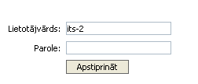

.. 6901
 
Degvielas pasūtījumi
========================
 
Tehniskās prasības Veiksmīgam darbam ar Degvielas pasūtījumu moduli
nodrošina interneta pārlūkprogrammas Internet Explorer 5.5 vai 6.0
SP1, Netscape Navigator 7.0 vai Mozilla Firefox 1.5. Lūdzu,
pārliecinieties vai Jūs izmantojat minētās pārlūkprogrammas.
Pārlūkprogrammu jaunākās versijas Jūs varat lejupielādēt to
izstrādātāju interneta mājaslapās :doc:`www.microsoft.com` ,
:doc:`www.netscape.com` , :doc:`www.getfirefox.com` .
Pārlūkprogrammai, kura tiek izmantota darbam ar Degvielas
pasūtījumiem, jāatļauj sīkdatņu (cookies) izmantošana un ērtākai
lietošanai ieteicams atļaut arī uznirstošo (pop-up) logu izmantošanu.

|images_ozols/24545.gif| Lai uzsāktu darbu ar Degvielas pasūtījumiem:

|images_ozols/25686.png| Atverot Explorer interneta pārlūkprogrammu,
Izvēlņu joslā jānospiež poga Tools un jāizvēlas Internet
Options..(skatīt attēlu):

|images_ozols/25553.png|

+ tiek atvērts Internet Options logs, kur sadaļā Privacy pie Pop-up
  Blocker jānospiež poga |images_ozols/25554.png| (skatīt attēlu):

|images_ozols/25555.png|

+ tiek atvērts logs Pop-up Blocker Settings, kur augšējā lodziņā
  jāieraksta adrese mnth.lv un jānospiež poga Add (skatīt attēlu):

|images_ozols/25556.png|

+ kad adrese ir pievienota, ar pogu Close jāaizver logs, un Internet
  Options logā jānospiež poga OK.

|images_ozols/25687.png| Atverot Mozilla interneta pārlūkprogrammu,
rīku joslā jānospiež poga Tools un jāizvēlas Options... (skatīt
attēlu):

|images_ozols/25676.png|

Tiek atvērts Options logs, un jāizvēlas sadaļa Content
|images_ozols/25688.png| , un, pie Block pop-up windows, jānospiež
poga |images_ozols/25690.png| :

|images_ozols/25689.png|

Tiek atvērts Allowed Sites - Popups logs:

|images_ozols/25692.png|

Lodziņā "Address of web site" jāieraksta adrese mnth.lv un jānospiež
poga |images_ozols/25693.png| . Tad jāaizver logi, nospiežot pogu OK.

+ Interneta adreses logā jāieraksta adrese :doc:` www.sales.mnth.lv `
+ jāieraksta lietotājvārds un parole, un jānospiež poga Apstiprināt,
  lai uzsāktu darbu ar Degvielas pasūtījumiem:

|images_ozols/25557.png|

+ ievadot sākotnējo paroli pirmo reizi, drošības apsvērumu dēļ,
  programma piedāvās obligāto paroles maiņu. Turpmāk uzsākot darbu ar
  programmu, būs jālieto jaunā parole.

.. |images_ozols/24545.gif| image:: images_ozols/24545.gif
       :scale: 100%

.. |images_ozols/25554.png| image:: images_ozols/25554.png
       :scale: 100%

.. |images_ozols/25687.png| image:: images_ozols/25687.png
       :scale: 100%

.. |images_ozols/25690.png| image:: images_ozols/25690.png
       :scale: 100%

.. |images_ozols/25689.png| image:: images_ozols/25689.png
       :scale: 100%

.. |images_ozols/25692.png| image:: images_ozols/25692.png
       :scale: 100%

.. |images_ozols/25693.png| image:: images_ozols/25693.png
       :scale: 100%


 
.. toctree::
   :maxdepth: 6
 
   6921.rst
   6906.rst
   6905.rst
   6931.rst
   6926.rst
   6910.rst
   6923.rst
