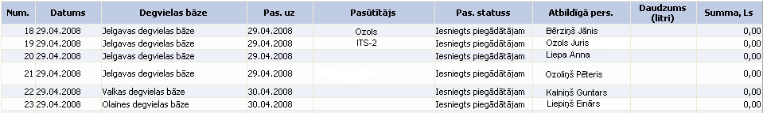

.. 6907
 
Pasūtījumu žurnāls
**********************
 
Pasūtījuma žurnālā ir apkopoti visi pasūtījumi:

|images_ozols/25578.png|

Num.: pasūtījuma numurs;

Datums: datums, kurā tika izveidots pasūtījums;

Degvielas bāze: nodefinētā degvielas bāze;

Pas. uz: datums uz kuru veikts pasūtījums;

Pasūtītājs: pasūtītājs, kurš veic pasūtījumu;

Pas. statuss: pasūtījuma statuss (iesniegts, apstiprināts, noraidīts,
izpildīts)

Atbildīgā pers.: atbildīgā persona par pasūtījuma izpildi;

Daudzums (litri): degvielas daudzums litros;

Summa, Ls: pasūtījuma summa latos.

|images_ozols/24545.gif| Lai izveidotu jaunu degvielas pasūtījumu,
degvielas pasūtījumu sadaļā Jauns jāizvēlas :doc:`Degvielas
pasūtījums<6904>` .

Ar filtra palīdzību iespējams atlasīt noteiktus pasūtījumus pēc
dažādiem izvēlētiem kritērijiem:

|images_ozols/25570.png|

Num.no_ līdz_ : pasūtījuma numurs;

Degvielas bāze: pasūtījumā nodefinētā degvielas bāze no saraksta;

Pasūtītājs: pasūtītājs, kurš veicis pasūtījumu (ar saraksta podziņu
|images_ozols/25564.png| izvēlas, ja vajag dzēst pasūtītāju, tad ar
dzēšanas podziņu |images_ozols/25571.png| , lai apskatītu izvēlētā
pasūtītāja informāciju, tad podziņa |images_ozols/25565.png| );

Datums no_ līdz_ : pasūtījuma datums (atvērt kalendāru ar podziņu
|images_ozols/25560.png| );

Pas.uz no_ līdz_ : datums uz kuru tika veikts pasūtījums (atvērt
kalendāru ar podziņu |images_ozols/25560.png| );

Pas. statuss: pasūtījuma statuss, ar bultiņu atverot statusa sarakstu
(tiek sagatavots, mainīts atbildīgais, izpildīts, iesniegts
piegādātājam, atcelts, apstiprināts);

Kad visi kritēriji izvēlēti, jānospiež poga Atlasīt .

.. |images_ozols/24545.gif| image:: images_ozols/24545.gif
       :scale: 100%

.. |images_ozols/25564.png| image:: images_ozols/25564.png
       :scale: 100%

.. |images_ozols/25571.png| image:: images_ozols/25571.png
       :scale: 100%

.. |images_ozols/25560.png| image:: images_ozols/25560.png
       :scale: 100%

.. |images_ozols/25560.png| image:: images_ozols/25560.png
       :scale: 100%


 
