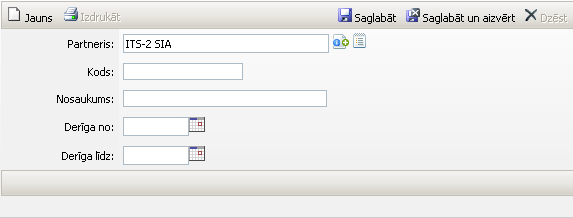
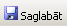
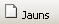
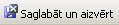

.. 6908
 
Licence
***********
 
Lai pievienotu jaunu Licenci:

|images_ozols/25559.png|

Partneris: partnera nosaukums (iespējams izvēlēties no saraksta,
nospiežot pogu |images_ozols/25564.png| , un pogu
|images_ozols/25565.png| , lai apskatītu partnera pamatinformāciju);

Kods: licences kods;

Nosaukums: licences nosaukums;

Derīga no: atverot kalendāra podziņu |images_ozols/25560.png| ,
jāizvēlas datums;

Derīga līdz: atverot kalendāra podziņu |images_ozols/25560.png| ,
jāizvēlas datums (nav obligāti)

Kad visi dati ievadīti, jānospiež poga |images_ozols/25561.png| un,
lai pievienotu jaunu licenci, jāspiež poga |images_ozols/25563.png| .
Ja jaunas licences vairs netiks pievienotas, jānospiež poga
|images_ozols/25562.png| pēc pēdējās licences pievienošanas.

Visas pievienotās licences ir redzamas :doc:`Licenču sarakstā<6912>` .

.. |images_ozols/25564.png| image:: images_ozols/25564.png
       :scale: 100%

.. |images_ozols/25565.png| image:: images_ozols/25565.png
       :scale: 100%

.. |images_ozols/25560.png| image:: images_ozols/25560.png
       :scale: 100%

.. |images_ozols/25560.png| image:: images_ozols/25560.png
       :scale: 100%


 
