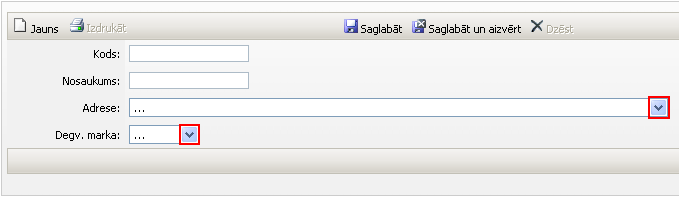

.. 6909
 
Tvertne
***********
 
Lai pievienotu jaunu Tvertni:

:scale: 100%

Kods: Tvertnes kods (nosaukuma saīsinājums vai apzīmējums);

Nosaukums: Tvertnes nosaukums;

Adrese: no adrešu saraksta, ar bultiņas pogu, jāizvēlas adresi, kurai
tiks pievienota šī jaunā tvertne;

Degv. marka: degvielas marka, kura ir attiecināma uz šo tvertni,
jāizvēlas ar bultiņas pogu.

Kad visi dati ievadīti, jānospiež poga .. image::
images_ozols/25561.png
:scale: 100%
un, lai pievienotu jaunu tvertni, jānospiež poga .. image::
images_ozols/25563.png
:scale: 100%
. Ja jaunas tvertnes vairs netiks pievienotas, jānospiež poga ..
image:: images_ozols/25562.png
:scale: 100%
pēc pēdējās tvertnes pievienošanas.

Visas pievienotās tvertnes ir redzamas :doc:`tvertņu sarakstā<6911>` .


 
