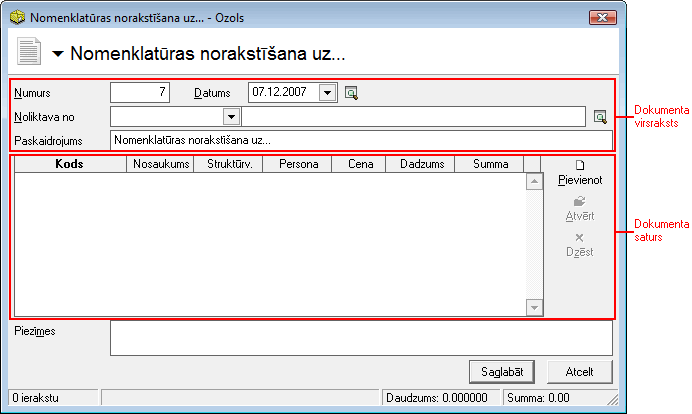
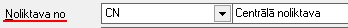
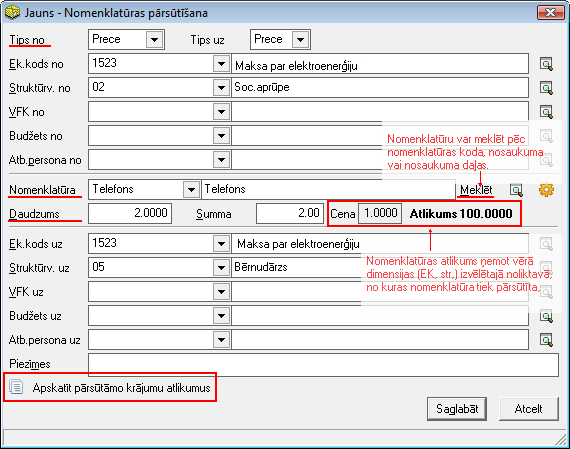
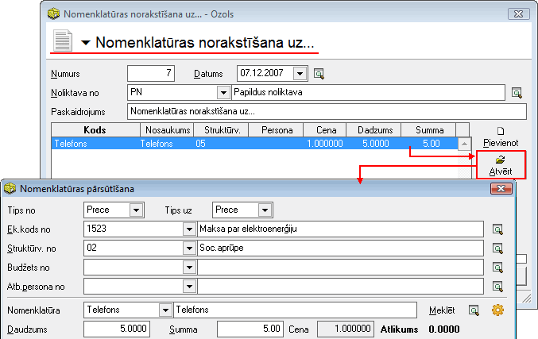

.. 692
 
Nomenklatūras norakstīšana uz
*********************************
 


Lai nodrošinātu nomenklatūras pārsūtīšanu uz uzņēmuma
:doc:`Struktūrvienībām<117>` un vienlaicīgi nomenklatūras norakstīšanu
no :doc:`Noliktavas<142>` , nepieciešams veidot Nomenklatūras
norakstīšana uz... dokumentu. Nomenklatūras norakstīšanas uz...
dokuments tiek saglabāts :doc:`Iekšējās kustības dokumentu
žurnālā<688>` .


Jauna Nomenklatūras norakstīšanas uz... dokumenta pievienošana
``````````````````````````````````````````````````````````````

Izvēloties dokumenta veidu Nomenklatūras norakstīšana uz, tiks atvērts
jauns logs:


|images_ozols/25347.png|


Nomenklatūrasnorakstīšanas uz...dokumentaVirsraksta aizpildīšana
++++++++++++++++++++++++++++++++++++++++++++++++++++++++++++++++

Lai aizpildītuNorakstīšanas uz...dokumenta Virsrakstu, nepieciešams:


1. Norādīt datumu, kurādarbībatiek veikta:


|images_ozols/25341.png|


2. Izvēlēties atbilstošo noliktavu, no kuras nomenklatūra tiks
nosūtīta un norakstīta:


|images_ozols/25348.png|


3. Norakstīšanas uz... dokumenta paskaidrojuma lauks tiek aizpildīts
automātiski - dati tiek ielādēti no Iekšējās kustības dokumenta veida
nosaukuma. Paskaidrojuma laukā esošo informāciju iespējams koriģēt,
labojot aizpildīto informāciju manuāli.


Nomenklatūrasnorakstīšanas uz...dokumenta Satura aizpildīšana
+++++++++++++++++++++++++++++++++++++++++++++++++++++++++++++

Lai aizpildītu Nomenklatūras norakstīšanas uz... dokumenta Saturu,
dokumenta satura daļā nepieciešams nospiest pogu
|images_ozols/24708.png| un tiks atvērts operācijas satura logs:


|images_ozols/25344.png|


Dokumenta saturā jāpievieno nomenklatūra, kas tiek pārsūtīta un
vienlaicīgi norakstīta uz struktūrvienību (apvienojot sevī divas
darbības - nomenklatūras pārsūtīšanu un nomenklatūras norakstīšanu),
aizpildot visas nepieciešamās dimensijas. Nomenklatūru var meklēt pēc
nomenklatūras koda, nosaukuma vai nosaukuma daļas. Nomenklatūrai tiek
parādīts atlikums noliktavā (ņemot vērā norādītās dimensijas), no
kuras jāveic pārsūtīšana un vienlaicīgi norakstīšana. Nomenklatūrai
jānorāda daudzums, kas jāpārsūta un jānoraksta uz izvēlētajām datu
uzskaites dimensijām.


|images_ozols/24545.gif| Ja tiek izvēlēta nomenklatūra un norādītas
dimensijas (Ek.kods no; Struktūrv.no) , bet atlikums uzrādās 0.0000,
nepieciešams pārbaudīt norādītās dimensijas un Atbildīgo personu – vai
nomenklatūrai, ar šādām norādītajām dimensijām, ir pārsūtīšanai
unvienlaicīgi norakstīšanainepieciešamie atlikumi attiecīgajās
dimensijās.


Lai saglabātu izveidoto satura ierakstu, nomenklatūras pārsūtīšanas
logā nepieciešams nospiest |images_ozols/24615.jpg| vai
|images_ozols/24617.jpg| - ja nomenklatūras pārsūtīšanu unvienlaicīgi
norakstīšanunav nepieciešams veikt.


|images_ozols/24545.gif| Nomenklatūrasnorakstīšanas uz...dokumenta
saturs var sastāvēt no vairākiem satura ierakstiem.Pievienot nākamo
satura ierakstu iespējams, satura daļā nospiežot pogu
|images_ozols/24708.png| .


Kad visi nepieciešamie lauki ir aizpildīti,Nomenklatūrasnorakstīšanas
uz...dokumentsir sagatavots - Nomenklatūra no norādītās Noliktavas būs
pārsūtīta un norakstīta - tā vairs nebūs atlikumā šajā Noliktavā, bet
būs norakstīta uz dokumenta saturā norādīto struktūrvienību.Dokumentu
ir iespējams:


1. Saglabāt,nospiežot pogu |images_ozols/24615.jpg| -dokuments tiks
saglabāts un būs pieejams apskatei/labošanai/grāmatošanai
:doc:`Iekšējās kustības dokumentu žurnālā<688>` .

2. Apstiprināt, nospiežot rīku joslā pogu |images_ozols/24740.png|
-Nomenklatūras norakstīšanas uz...dokuments tiks Apstiprināts un to
būs iespējams Grāmatot.


Nomenklatūrasnorakstīšanas uz...dokumenta grāmatošana
`````````````````````````````````````````````````````

Nomenklatūrasnorakstīšanas uzdokumentuiespējams grāmatot no atvērta
dokumenta vai izvēloties (iezīmējot)dokumentu :doc:`Iekšējās kustības
dokumentu žurnālā<688>` .

Lai iegrāmatotu Nomenklatūras norakstīšanu uz, dokumentu nepieciešams
Apstiprināt, nospiežot rīku joslā pogu |images_ozols/24740.png| .
Apstiprinātu dokumentu ir iespējams grāmatot, nospiežot rīku joslā
pogu |images_ozols/24741.png| .


Instrukcija - :doc:`Dokumentu grāmatošanas principi<14044>`


PievienotāNorakstīšanas uz...dokumenta labošana
```````````````````````````````````````````````

Labojumus saglabātajādokumentā iespējams veikt atverot Nomenklatūras
norakstīšanas uz... dokumentu, kurš pieejams apskatei/labošanai
:doc:`Iekšējās kustības dokumentu žurnālā<688>` . Lai veiktu
labojumusNomenklatūras norakstīšanas uz...
dokumentā,dokumentunepieciešams atvērt, izmantojot rīku joslas pogu
|images_ozols/24709.png| (ALT+A), unatvērtajāierakstā iespējams
veiktnepieciešamos labojumus:


|images_ozols/25350.png|


|images_ozols/24545.gif| Nomenklatūrasnorakstīšanas uzdokumenta datumu
NAV iespējams labot, jo nomenklatūras atlikumi Noliktavā, ņemot vērā
norādītās dimensijas, tiek rēķināti atbilstoši iepriekš izvēlētajam
datumam un datuma maiņa varētu novest pie situācijas, kad nomenklatūra
tiek pārsūtīta un norakstīta brīdī, kad tās faktiski nemaz nav
atlikumā. Ja nepieciešams labot datumu, tad dokuments ir jāveido no
jauna un iepriekš izveidotais dokuments jādzēš!


Pēc labojumu veikšanas, veiktā izmaiņas iespējams
|images_ozols/24615.jpg| vai |images_ozols/24617.jpg| .



.. |images_ozols/25341.png| image:: images_ozols/25341.png
       :scale: 100%



.. |images_ozols/24708.png| image:: images_ozols/24708.png
       :scale: 100%



.. |images_ozols/24545.gif| image:: images_ozols/24545.gif
       :scale: 100%

.. |images_ozols/24615.jpg| image:: images_ozols/24615.jpg
       :scale: 100%

.. |images_ozols/24617.jpg| image:: images_ozols/24617.jpg
       :scale: 100%

.. |images_ozols/24545.gif| image:: images_ozols/24545.gif
       :scale: 100%

.. |images_ozols/24708.png| image:: images_ozols/24708.png
       :scale: 100%

.. |images_ozols/24615.jpg| image:: images_ozols/24615.jpg
       :scale: 100%

.. |images_ozols/24740.png| image:: images_ozols/24740.png
       :scale: 100%

.. |images_ozols/24740.png| image:: images_ozols/24740.png
       :scale: 100%

.. |images_ozols/24741.png| image:: images_ozols/24741.png
       :scale: 100%

.. |images_ozols/24709.png| image:: images_ozols/24709.png
       :scale: 100%



.. |images_ozols/24545.gif| image:: images_ozols/24545.gif
       :scale: 100%

.. |images_ozols/24615.jpg| image:: images_ozols/24615.jpg
       :scale: 100%

.. |images_ozols/24617.jpg| image:: images_ozols/24617.jpg
       :scale: 100%


 
