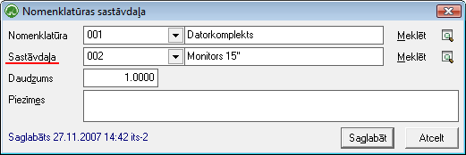

.. 695
 
Nomenklatūras sastāvdaļas
*****************************
 

Sarakstā tiek attēlots nomenklatūras saraksts, kurām ir piesaistītas
sastāvdaļas, attēlojot sastāvdaļas nosaukumu un daudzumu.

Krājumiem vai Precēm, kuras uzņēmumā netiek iepirkts gatavas, bet
uzņēmuma ietvaros tiek ražotas vai komplektētas, nepieciešams norādīt
sastāvdaļas, no kā šis gatavais komplekts sastāvēs.

Lai nomenklatūrai pievienotu sāstāvdaļas no Nomenklatūras sastāvdaļu
saraksta, rīku joslā nepieciešams nospiest pogu
|images_ozols/24708.png| un tiks atvērts jauns logs:

|images_ozols/25334.png|

Pēc nepieciešamās nomenklatūras un tai piesaistāmās sastāvdaļas
izvēles no nomenklatūras saraksta, iespējams norādīt sastāvdaļas
sastāva daudzumu un aizpildīto ierakstu |images_ozols/24615.jpg| vai
|images_ozols/24617.jpg| .

.. |images_ozols/24708.png| image:: images_ozols/24708.png
       :scale: 100%

.. |images_ozols/24615.jpg| image:: images_ozols/24615.jpg
       :scale: 100%

.. |images_ozols/24617.jpg| image:: images_ozols/24617.jpg
       :scale: 100%


 
