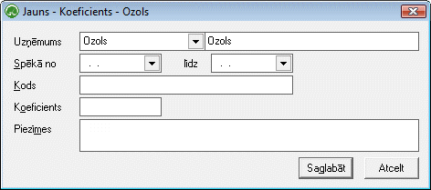
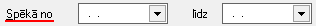
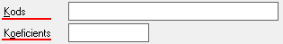

.. 7008
 
Koeficients
***************
 

Izmantojot šo darba režīmu, iespējams pievienot jaunu Koeficientu
esošajam :doc:`Koeficientu<7007>` sarakstam.

|images_ozols/25459.png|

1. Atvērtajā Koeficienta apraksta logā iespējams norādītKoeficienta
darbības periodu:

|images_ozols/25460.png|

2. Koeficienta kodu un vērtību:

|images_ozols/25461.png|

Ieraksts tiks saglabāts, izpildot komandu |images_ozols/24710.png| .

.. |images_ozols/24710.png| image:: images_ozols/24710.png
       :scale: 100%


 
