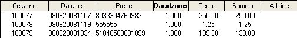
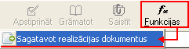
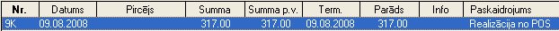
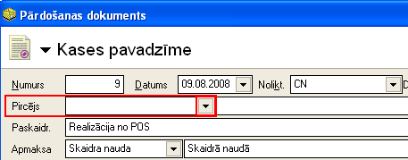

.. 7121
 
Čeki
********
 
Čeku žurnālā tiek saglabāti visi, no kases ieimportētie, realizācijas
čeki. Dokumentu sarakstā tiek attēlots:

:scale: 100%

Čeka nr.: čeka numurs;

Datums: datums un laiks;

Prece: preces kods;

Daudzums: realizētās preces daudzums vienā čekā;

Cena: preces realizācijas cena;

Summa: preces cenu summa;

Atlaide: atlaide, ja tāda tiek pielietota.

Pievienojot papildus kolonnas, iespējams redzēt arī papildus
informāciju.

.. image:: images_ozols/24545.gif
:scale: 100%
Lai no ieimportētajiem realizācijas čekiem tiktu uzģenerēti pārdošanas
dokumenti, kuri būs pieejami :doc:`pārdošanas dokumentu žurnālā<204>`
, jāveic realizācijas dokumentu sagatavošanas funkcija:

:scale: 100%

Kad šī funkcija ir veikta, :doc:`pārdošanas dokumentu žurnāla<204>`
tika pievienotas kases pavadzīmes ar Paskaidrojuma tekstu Realizācija
no POS:

:scale: 100%

Uzģenerētos pārdošanas dokumentus (kases pavadzīmes) nepieciešams
atvērt, nospiežot rīku joslā pogu .. image:: images_ozols/25603.png
:scale: 100%
, un jāpievieno pircējs (piem., Klients):

:scale: 100%

Kad Pircēja lauks aizpildīts, dokuments jāapstiprina un, ja
nepieciešams, :doc:`jāiegrāmato<14044>` .


 
