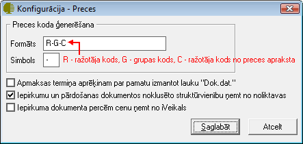
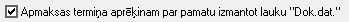
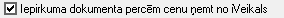

.. 716
 
Noliktava
*************
 
Nomenklatūras koda ģenerēšanu nosaka konfigurācijas iestādījumi:

|images_ozols/25311.png|

Nomenklatūras koda veidošanu nosaka konfigurācijas formāts, kur
atbilstošā rakstzīme ir viens simbols no dažādiem preces apraksta
kodiem. Piemēram, ja nomenklatūras koda formātā norādīts RR, tas
nozīmē, ka nomenklatūras kods sāksies ar pirmajiem diviem simboliem no
pievienotā ražotāja koda. Laukā Simbols var norādīt datu atdalītāju.

|images_ozols/25312.png|

Atzīmējot šo izvēles rūtiņu, dokumenta apmaksas termiņš tiks
aprēķināts, par pamatu izmantojot norādīto dokumenta datumu laukā
"Dok.dat."

|images_ozols/25314.png|

Atzīmējot šo izvēles rūtiņu, iepirkumu un pārdošanas dokumentu saturā
lauks "struktūrvienība", tiks aizpildīts no dokumentu virsrakstā
norādītās Noliktavas piesaistītās struktūrvienības (Noliktavai
struktūrvienību iespējams piesaistīt :doc:`Noliktavas<142>` aprakstā).

|images_ozols/25315.png|

Izvēles rūtiņa jāatzīmē, ja Ozols modulis Noliktava tiek saistīts kopā
ar uzņēmumā esošoiVeikalu, lai cena iepirkuma dokumenta precēm tiktu
ņemta no iVeikalā norādītās.


 
