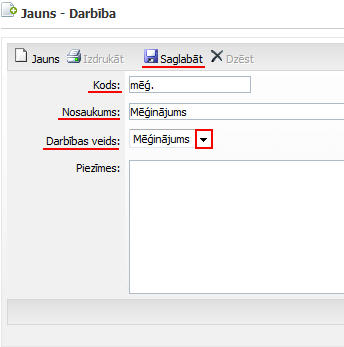

.. 7307
 
Darbība
***********
 
Pievienotās un saglabātās darbības tiek saglabātas :doc:`darbības
sarakstā<7316>` .

Darbību sarakststiek izmantotas :doc:`notikumu <7308>` pievienošanā
:doc:`atskaišu<7317>` sagatavošanā.

:scale: 100%

Kods: darbības nosaukuma apzīmējums, saīsinājums;

Nosaukums: darbības pilns nosaukums;

Darbības veids: no saraksta jāizvēlas darbības veids;

Iespējams pievienot dažādas piezīmes .

Lai pievienotā darbība tiktu saglabāta, jānospiež poga .. image::
images_ozols/25829.png
:scale: 100%
, un, ja nepieciešams pievienot vēl citu darbību, jānospiež poga ..
image:: images_ozols/25850.png
:scale: 100%
un jāpievieno jauna darbība. Lai, pēc saglabāšanas, labotu
pievienotāsdarbības ierakstus, jānospiež poga .. image::
images_ozols/25832.png
:scale: 100%
un pēc labošanas ieraksts jāsaglabā.


 
