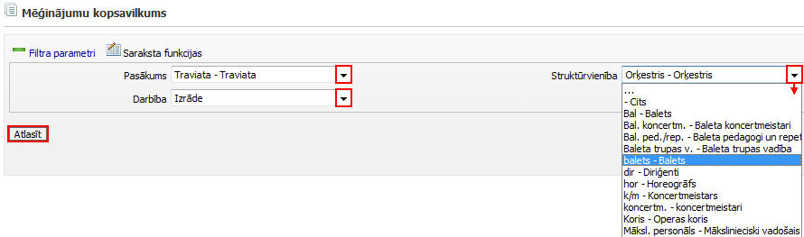
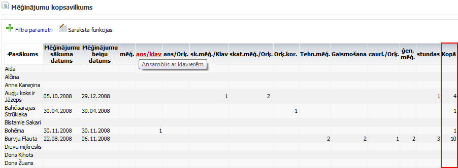
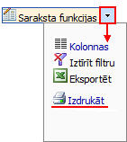

.. 7321
 
Mēģinājumu kopsavilkums
***************************
 
Mēģinājumu kopsavilkuma atskaitē ir redzami visi pievienotie un
apstiprinātie mēģinājumi ( :doc:`darbības<7307>` ). Mēģinājumu
kosavilkuma atskaiti iespējams sagatavot pēc konkrētiem kritērijiem
(filtra parametriem). Lai sagatavotu atskaiti, ja nepieciešmas,
jānorāda kāds no atlasīšanas kritērijiem un jānospiež poga
|images_ozols/26172.jpg| :

|images_ozols/26170.jpg|

Iespējams atlasīt mēģinājumus pēc viena konkrēta :doc:`Pasākuma<7312>`
, :doc:`Darbības<7316>` vai :doc:`Struktūrvienības<7313>` .

Mēģinājumu kopsavilkuma atskaitē redzams pasākuma nosaukums,
mēģinājuma sākuma un beigu datums, darbību skaits un kopīgais
mēģinājumu skaits:

|images_ozols/26171.jpg|

Aktivizējot katru kolonnas virsrakstu, parādās saīsinātā darbības
nosaukuma atšifrējums (pilns nosaukums).

|images_ozols/24545.gif| Mēģinājuma kopsavilkumā ir redzami tikai
apstiprinātie mēģinājumi ( :doc:`darbības<7307>` ).

Kopsavilkumu iespējams izdrukāt, nospiežot uz saraksta funkciju izvēli
un izvēloties Izdrukāt:

|images_ozols/26173.jpg|

.. |images_ozols/26172.jpg| image:: images_ozols/26172.jpg
       :scale: 100%

.. |images_ozols/24545.gif| image:: images_ozols/24545.gif
       :scale: 100%


 
