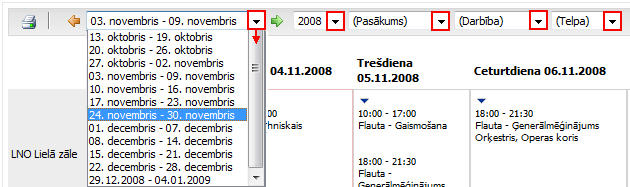
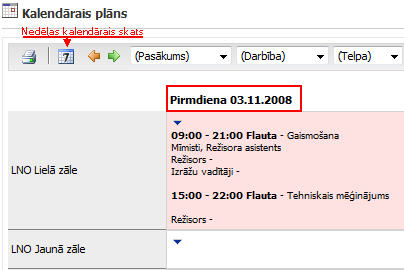
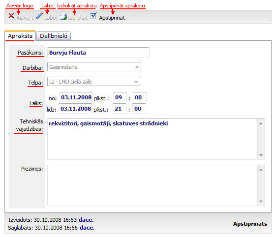

.. 7323
 
=====================
Kalendārais plāns
=====================
 
Kalendārais plāns ir visu pievienoto :doc:`notikumu<7308>` (
:doc:`pasākumu<7303>` , :doc:`darbību<7307>` ) attēlojums pa
:doc:`telpām<7306>` , datumiem, laikiem, nosaukumiem un darbībām.
Kalendārajā plānā ir iespējams redzēt visus pasākumus pa visām telpām
vienā konkrētā nedēļā, vai arī atlasīt pēc konkrēta kritērija
(kalendārā nedēļa, :doc:`pasākuma nosaukums<7312>` ,
:doc:`darbība<7316>` , :doc:`telpa<7315>` ), kā arī, izdrukāt
atlasītos informāciju:

|images_ozols/26155.jpg|

Informācijas atlasīšanas iespējas
+++++++++++++++++++++++++++++++++

Informāciju iespējams atlasīt, katra izvēles lodziņa labajā pusē
nospiežot uz bultiņas ( |images_ozols/26157.jpg| ), un izvēloties no
saraksta attiecīgos atlasīšanas kritērijus:

|images_ozols/26156.jpg|

Informācijas atlasīšanas kritēriju sarakstā ir pieejama tā
informācija, kura ir nodefinēta un saglabāta :doc:`Mākslinieciskā
darba plānošanas sarakstos<7311>` ( :doc:`darbības<7316>` ,
:doc:`pasākumi<7312>` , :doc:`telpas<7315>` ).

Pasākumu ieraksta atvēršana no kalendārā vai dienas plāna
+++++++++++++++++++++++++++++++++++++++++++++++++++++++++

No Nedēļas kalendārā plāna ir iespējams atvērt arī dienas plānu,
nospiežot ar peles kreiso taustiņu uz izvēlētās dienas/datuma, atveras
dienas plāns:

|images_ozols/26158.jpg|

Nospiežot bultiņas pogu |images_ozols/26160.jpg| tiek atvērts
iepriekšējās dienas plāns, bet nospiežot pogu |images_ozols/26161.jpg|
- tiek atvērts nākošās dienas plāns.

Nospiežot pogu |images_ozols/26162.jpg| ir iespējams izdrukāt dienas
plānu.

Lai no dienas plāna, atvērtu konkrētu :doc:`Pasākumu<7312>` ,
jāaktivizē pasākuma ieraksts dienas vai kalendāra plānā, un,
aktivizējot ierakstu, ar peles kreiso taustiņu, tiek atvērts jau
pievienots :doc:`pasākuma<7303>` ieraksta logs:

|images_ozols/26163.jpg|

Apraksta sadaļā redzams pasākuma nosaukums, darbība, telpa, pasākuma
datums un laiks, nodefinētās tehniskās vajadzības.

Atverot Dalībnieku sadaļu - |images_ozols/26164.jpg| , redzams
pasākuma dalībnieku saraksts:

|images_ozols/26165.jpg|

Dalībnieku sadaļas ierakstus iespējams kārtot pēc
:doc:`sturktūrvienības<7313>` , lomas, :doc:`personas<7314>` ,
uzstāšanās laika vai radošās brigādes. Loga lejas daļā redzama
ieraksta informācija un ieraksta statuss.

Lai labotu notikumu, jānospiež poga |images_ozols/25832.png| :

|images_ozols/26193.jpg|

Sadaļā Apraksts , iespējams labot notikuma informāciju. Pasākuma
nosaukumu iespējams ierakstīt manuāli, ja nav bijis nodefinēts jau
iepriekš, tā saglabājot pasākuma pamatinformāciju :doc:`pasākuma
sarakstā<7312>` .

Lai pievienotu jaunu darbību, kura nav sarakstā, jānospiež poga
|images_ozols/26169.jpg| un jāsaglabā pievienotā :doc:`darbība<7307>`
. Tāpat, ja nepieciešams,no notikuma apraksta tiekpievienots jaunas
:doc:`telpas <7306>` ieraksts.

Dalībnieku sadaļā iespājams nodefinēt lomas pievienotajiem
dalībniekiem, labot uzstāšanās laikus,un, janav nodefinēta radošā
brigāde,katrai pievienotajai personaitiekatzīmēts ir vai nav radošā
brigāde.Ja nepieciešams pievienot jaunus dalībniekus attiecīgajam
notikumam:

|images_ozols/26194.jpg|

Lai notikumam pievienotu jaunus dalībniekus, jānospiež poga
|images_ozols/26169.jpg| Pievienot, tiek atvērts logs:

|images_ozols/26195.jpg|

No dalībnieku izvēles saraksta jāartzīmē tos dalībniekus, kurus
jāpievieno notikuma dalībnieku sarakstam, un loga visus daļā jānospiež
bultiņas, lai pievienotu dalībniekus. Ja nepieciešams izņemt kādu no
pievienotajiem dalībniekiem, tad attiecīgi loga labajā pusē jāatzīmē
dalībniekus, un jānospiež bultiņas, lai pārvietotu atzīmētos
dalībniekus uz dalībnieku izvēles saraksta pusi.

Ja nepieciešams pievienot dalībnieku, kurš nav izvēles sarakstā, tad
loga labajā pusē jānospiež poga |images_ozols/26169.jpg| Pievienot, un
tiek atvērts logs:

|images_ozols/26196.jpg|

Atvērtajā logā jāatzīmē (jāieķeksē) tie dalībnieki, kuri tiks
pievienoti notikuma dalībnieku sarakstam, un jānospiež poga Pievienot:
|images_ozols/26197.jpg|

Lai no dienas plāna aizietu atpakaļ uz nedēļas kalendārā plāna skatu,
jānospiež kalendāra podziņa |images_ozols/26159.jpg| .

Jauna notikuma pievienošana nedēļas/ dienas kalendārajā plānā
+++++++++++++++++++++++++++++++++++++++++++++++++++++++++++++

Kalendārajā nedēļas vai dienas plānā ir iespējams pievienot
:doc:`jaunu notikumu<7308>` . Jauna notikuma pievienošana iespējama
arī moduļa sadaļā :doc:`jauns notikums<7308>` .

Lai pievienotu jaunu notikumu noteiktā datumā, noteiktās telpas
ierakstu logā jānospiež uz bultiņas notikumu informatīvajā
skatlodziņā:

|images_ozols/26166.jpg|

Jauna notikuma pievienošanas apraksts sadaļā :doc:`Jauns
notikums<7308>` .

.. |images_ozols/26155.jpg| image:: images_ozols/26155.jpg
       :scale: 100%

.. |images_ozols/26157.jpg| image:: images_ozols/26157.jpg
       :scale: 100%

.. |images_ozols/26160.jpg| image:: images_ozols/26160.jpg
       :scale: 100%

.. |images_ozols/26162.jpg| image:: images_ozols/26162.jpg
       :scale: 100%

.. |images_ozols/26164.jpg| image:: images_ozols/26164.jpg
       :scale: 100%

.. |images_ozols/26165.jpg| image:: images_ozols/26165.jpg
       :scale: 100%

.. |images_ozols/25832.png| image:: images_ozols/25832.png
       :scale: 100%

.. |images_ozols/26193.jpg| image:: images_ozols/26193.jpg
       :scale: 100%

.. |images_ozols/26194.jpg| image:: images_ozols/26194.jpg
       :scale: 100%

.. |images_ozols/26195.jpg| image:: images_ozols/26195.jpg
       :scale: 100%

.. |images_ozols/26196.jpg| image:: images_ozols/26196.jpg
       :scale: 100%

.. |images_ozols/26197.jpg| image:: images_ozols/26197.jpg
       :scale: 100%

.. |images_ozols/26159.jpg| image:: images_ozols/26159.jpg
       :scale: 100%

.. |images_ozols/26166.jpg| image:: images_ozols/26166.jpg
       :scale: 100%


 
