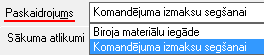

.. 748
 
Avansa norēķins
*******************
 
Avansa norēķina dokuments apkopo Avansu personas sākuma atlikumu uz
noteikto perioda sākuma datumu, saņemtos maksājumu avansa norēķina
periodā, avansa izdevumus avansa norēķina periodā un beigu atlikumu uz
noteikto perioda beigu datumu Avansa personas kontā.


JaunaAvansa norēķina pievienošana
`````````````````````````````````

Laiizveidotu Avansa norēķinu Avansu personā, izvēloties dokumenta
veidu Avansa norēķins, tiks atvērts jauns logs:


.. image:: images_ozols/25258.png
:scale: 100%


Avansa norēķinaVirsraksta aizpildīšana
++++++++++++++++++++++++++++++++++++++

Lai aizpildītuAvansa norēķinaVirsrakstu, nepieciešams:


1. Laukā Persona, izvēlēties :doc:`Avansu norēķinu personu<196>` no
saraksta:


:scale: 100%


.. image:: images_ozols/24545.gif
:scale: 100%
Aizpildot lauku Persona , automātiski tiks aizpildīts lauks konts,
kurā tiks ielasīts grāmatvediskais konts, kāds norādīts :doc:`Avansu
personas<196>` aprakstā (sadaļā Pārējie dati).


2. Izvēlēties Avansa norēķina perioda beigu datumu:


.. image:: images_ozols/24811.png
:scale: 100%


.. image:: images_ozols/24545.gif
:scale: 100%
Lauks Iepriekšējā norēķina datums tiek aizpildīts automātiski - tiek
ielādēts Avansu norēķina personas iepriekšējā Avansu norēķina beigu
datums. Ja šis Avansu norēķina dokuments ir pirmais izvēlētajai
norēķina personai, tad laukā Iepriekšējais norēķins - datums netiks
aizpildīts un paliks tukšs.


3.Izvēlēties Avansa norēķina paskaidrojumu no saraksta vai ievadīt
manuāli - ar roku:



:scale: 100%


Avansa norēķina Satura aizpildīšana
+++++++++++++++++++++++++++++++++++

Avansa norēķina Saturs sastāv no četrām šadāļām - Sākuma atlikumi,
Maksājumi, Izdevumi un Beigu atlikumi:


.. image:: images_ozols/25261.png
:scale: 100%


1. Izvēlētās Avansu norēķina personas Sākuma atlikumi - Ja avansu
norēķins tiek sagatavots pirmo reizi, avansa atlikums personai tiek
sarēķināts no atlikuma avansu norēķinu kontā, kas ir pievienots kontu
atlikuma sarakstā (Virsgrāmata -> Dokumenti -> :doc:`Kontu
atlikumi<146>` ). Personai naudas atlikums tiek meklēts :doc:`Avansu
personas<196>` aprakstā (sadaļā Pārējie dati)norādītajā av.nor.pers.
kontā. Veidojot nākamos avansu norēķinus sākuma atlikums tiek
noteikts, ņemot vērā iepriekšējā avansu norēķina beigu atlikuma summu.


2. Maksājumi - Saņemtie avansu maksājumi - summa no :doc:`Kases avansa
maksājuma<471>` (Avansa pieprastījuma - :doc:`Avansa maksājums<465>`
)vai no :doc:`Bankā izmaksāta avansa<469>` . Kā arī atgrieztās summas
no Kases un Bankas ieņēmumu dokumentu veidiem (:doc:`Bankā atgriezts
avanss<473>` un :doc:`Kasē atgriezts avanss<474>` ).

.. image:: images_ozols/24545.gif
:scale: 100%
Lai avansu norēķina dokumentā parādītos saņemtās un atgrieztās avansu
summas, naudas izmaksas dokumentiem jābūt izveidotiem kā avansa
pieprasījums vai atgriezts avanss, kā arī jābūt apstiprinātiem.
Saņemtās un atgrieztās avansu summas tiek noteiktas laika periodā no
iepriekšējā avansu norēķina dokumenta sagatavošanas datuma līdz jaunā
avansu norēķinu dokumenta sagatavošanas datumam.


3. Izdevumi - Avansu norēķinu personas avansu izdevumi.

:doc:`Avansa izdevumi<747>` tiek veidoti no atvērtas avansu norēķinu
formas, nospiežot Avansa norēķina izdevumu sadaļā esošo pogu
"Pievienot":


.. image:: images_ozols/25262.png
:scale: 100%


4. Beigu atlikumi - atlikums Avansu norēķinu personai piesaistītajā
grāmatvediskajā kontā uz avansu perioda beigu datumu.


.. image:: images_ozols/24545.gif
:scale: 100%
Avansa norēķina izdrukā Konti pie dokumentu ierakstiem tiek parādīti
no pievienoto finanšu kodu aprakstiem (Lai avansu norēķina dokumenta
izdrukā parādītos konti blakus dokumentu ierakstiem, dokumentu saturā
jāpievieno finanšu kodi un kodu aprakstā jābūt norādītiem izdevumu
kontiem), bet grāmatojuma kopsavilkumā avansu norēķina izdrukas
augšpusē no grāmatojuma datiem. Lai korekti sagatavotu avansa norēķina
izdruku, avansa izdevumu dokumentu saturā jānorāda finanšu kodi un
pirms drukāšanas katrs :doc:`Avansa izdevuma<747>` dokuments ir
jāiegrāmato.



 
