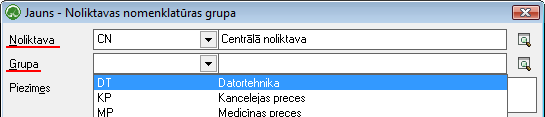

.. 752
 
Noliktavu nomenklatūras grupas
**********************************
 

Sarakstā tiek attēlots, kurās :doc:`Noliktavās<142>` tiek uzskaitītas
kuras nomenklatūras/pakalpojumu :doc:`Grupas<148>` .

Saraksta mērķis ir ierobežot noliktavas nomenklatūras/pakalpojumu
klāstu pie nomenklatūras/pakalpojumu izvēles fiksētajos izvēles
laukos.

Nomenklatūras grupaspievienošana Noliktavai:
++++++++++++++++++++++++++++++++++++++++++++

Lai pievienotu Nomenlatūras grupu Noliktavai, tādejādi ierobežojot
Noliktavas nomenklatūras klāstu pie nomenklatūras izvēles, ja norādīta
konkrēta noliktava, rīku joslājānospiež poga |images_ozols/24708.png|
un tiks atvērts jauns logs:

|images_ozols/25333.png|

Norādot nepieciešamo Noliktavu un izvēloties Grupu, no saraksta,
ierakstuiespējams |images_ozols/24615.jpg| , lai Noliktavai tiktu
piesaistīta nomenklatūras grupavai |images_ozols/24617.jpg| .

.. |images_ozols/24708.png| image:: images_ozols/24708.png
       :scale: 100%

.. |images_ozols/24615.jpg| image:: images_ozols/24615.jpg
       :scale: 100%

.. |images_ozols/24617.jpg| image:: images_ozols/24617.jpg
       :scale: 100%


 
