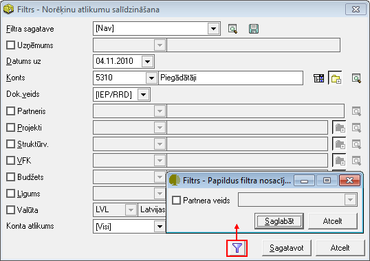

.. 757
 
Norēķinu atlikumu salīdzināšana
***********************************
 
Norēķinu atlikumu salīdzināšanas atskaiti iespējams sagatavot pēc
noteiktiem atlasīšanas kritērijiem.
Filtrs jāaizpilda, lai sagatavotu atskaiti.

Dati uz ekrāna tiek parādīti atbilstoši norādītajiem datu atlases
kritērijiem filtra ekrāna formā. Filtru var uzlikt, lai ierobežotu
kādu datu parādīšanu uz ekrāna, iegūstot nepieciešamās izdrukas, vai
arī ātrāk sameklētu nepieciešamos datus. Filtrs tiek izmantots arī
atskaišu sagatavošanā un atsevišķu dokumentu satura aizpildīšanā.

Datu atlases kritērijus var saglabāt (.. image::
images_ozols/24938.png
:scale: 100%
). Izvēloties izveidoto filtra sagatavi (.. image::
images_ozols/24943.png
:scale: 100%
), filtrs tiek automatizēti aizpildīts no filtra sagataves. Lai
izveidotu atskaiti pēc vēlamajiem kritērijiem, Rīku joslā jānospiež
poga .. image:: images_ozols/24535.gif
:scale: 100%
(Ctrl+F), tiek atvērts filtra logs:

:scale: 100%

Uzņēmums: uzņēmums, par kuru tiks gatavota atskaite;

Datums: periods, par kuru tiks gatavota atskaite;

**Konts:** grāmatvediskais konts, par kuru tiek salīdzināti norēķinu
atlikumi;

**Dok.veids:** dokumentu veids, balstoties uz kuriem norēķini tiks
salīdzināti - pirmdokumenti (iepirkumu un pārdošanas dokumenti -
informācija tiks ņemta no norēķinu dokumentiem) vai grāmatojumi
(informācija tiks ņemti no grāmatojumiem Virsgrāmatā)

Partneris: pircējs/piegādātājs, kuram tiek sagatavota atskaite par
norēķinu atlikumu salīdzināšanu;

Projekti: dimensiju dalījums;

Struktrūv.: dimensiju dalījums;

VFK: dimensiju dalījums;

Budžets: dimensiju dalījums;

Līgums: dimensiju dalījums;

Valūta: norēķinu valūta;

Konta atlikums: iespēja filtra iestādījumos norādīt, vai atskaitē tiks
iekļauti dati, kur savstarpēji salīdzinot norēķinus neveidojas
starpība.

Sagatavojot atskaiti, iespējams definēt arī papildus filtra
nosacījumus (izvēloties dokumenta veidu) un nospiežot pogu .. image::
images_ozols/25621.png
:scale: 100%
, un, ja filtrā visi atskaites kritēriji izvēlēti, jānospiež poga ..
image:: images_ozols/25619.png
:scale: 100%
. Sagatavotos atskaites datus ir iespējams arī izdrukāt. Lai drukātu
datus, rīko joslā jānospiež poga.. image:: images_ozols/24944.png
:scale: 100%
(Ctrl+P), un jānospiež poga .. image:: images_ozols/25620.png
:scale: 100%
.


 
