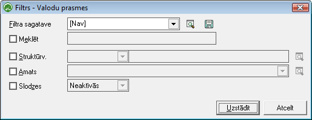
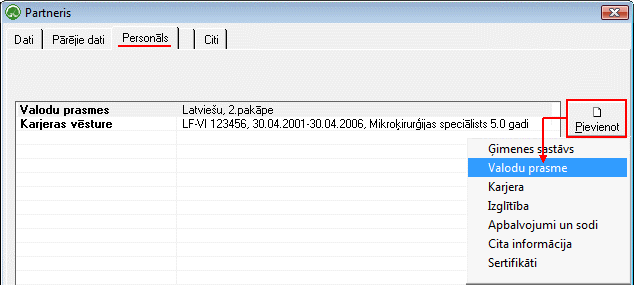

.. 761
 
Valodu prasmes
******************
 

Valodas prasmjudokumentu žurnālā tiek saglabāti visi
:doc:`Strādājošo<111>` kartiņās pievienotie dati par valodu zināšanām.

Lai atlasītu dokumentus, jāizmanto datu atlases filtrs. Dati uz ekrāna
tiek parādīti atbilstoši norādītajiem datu atlases kritērijiem filtra
ekrāna formā. Rīku joslā nopiežot pogu |images_ozols/24535.gif|
(Ctrl+F), tiek atvērts filtra logs:

|images_ozols/26111.png|

Struktūrv. :atlasīt informāciju par valodu prasmēm, konkrētā
struktūrvienībā strādājošajiem;

Amats :atlasīt informāciju parvalodu prasmēmstrādājošiem pēc
filtrāizvēlētā Amata nosaukuma;

Slodzes: Dokumentu žurnālā iespējams atlasīt datus - informāciju
parvalodu prasmēm tikai Aktīvajām vai Neaktīvajām slodzēm.

Lai Dokumentu žurnālā datus atlasītu pēc izvēlētajiem datu atlases
kritērijiem, pēc filtra iestādījumu aizpildīšanas, jānospiež poga
|images_ozols/25944.png| .

Informācijas pievienošana par valodas prasmēm
+++++++++++++++++++++++++++++++++++++++++++++

1. :doc:`Strādājošā aprakstā<111>` , sadāļā Personāls - iespējams
pievienot informāciju par strādājošā valodas prasmēm:

|images_ozols/25736.png|

Kad valodu prasmes dati pievienoti, jānospiež poga
|images_ozols/25621.png| . Visi strādājošam pievienotie dati par
valodu prasmi tiek saglabāti :doc:`Valodu prasmju<761>` žurnālā.

.. |images_ozols/24535.gif| image:: images_ozols/24535.gif
       :scale: 100%

.. |images_ozols/25944.png| image:: images_ozols/25944.png
       :scale: 100%

.. |images_ozols/25621.png| image:: images_ozols/25621.png
       :scale: 100%


 
