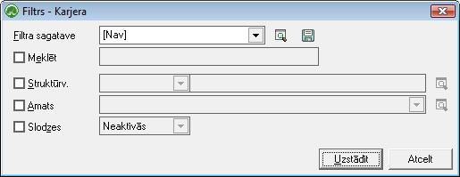
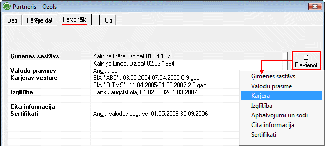
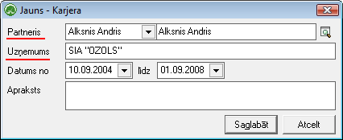

.. 762
 
Karjera
***********
 

Karjeras dokumentu žurnālā tiek saglabāti visi :doc:`Strādājošo<111>`
kartiņās pievienotie dati par Personas līdzšinējo karjeru.

Lai atlasītu dokumentus, jāizmanto datu atlases filtrs. Dati uz ekrāna
tiek parādīti atbilstoši norādītajiem datu atlases kritērijiem filtra
ekrāna formā. Rīku joslā nopiežot pogu |images_ozols/24535.gif|
(Ctrl+F), tiek atvērts filtra logs:

|images_ozols/26100.png|

Struktūrv. : Iespēja atlasīt informāciju par karjeru, konkrētā
struktūrvienībā strādājošajiem;

Amats :Iespēja atlasīt informāciju par karjeru strādājošiem pēc
filtrāizvēlētā Amata nosaukuma;

Slodzes: Dokumentu žurnālā iespējams atlasīt datus - informāciju
parkarjerutikai Aktīvajām vai Neaktīvajām slodzēm.

Lai Dokumentu žurnālā datus atlasītu pēc izvēlētajiem datu atlases
kritērijiem, pēc filtra iestādījumu aizpildīšanas, jānospiež poga
|images_ozols/25944.png| .

Karjeras datu pievienošana
++++++++++++++++++++++++++

Informāciju par karjerustrādājošajam iespējams izveidot:

1. :doc:`Strādājošā aprakstā<111>` , sadāļā Personāls - iespējams
pievienot strādājošā karjeras datus:

|images_ozols/25780.png|

2. Atrodoties :doc:`Karjeras dokumentu žurnālā<762>` un rīku
joslānospiežot pogu |images_ozols/24708.png| :

Izvēloties pievienot Karjerasdatus, jāizvēlas slodze (strādājošais),
kuram šī informācija tiks pievienota:

|images_ozols/26101.png|

Nepieciešamsievadīt uzņēmuma nosaukumu, laika termiņu no...līdz, kā
arī iespēja ievadīt karjeras aprakstu (piemēram, ieņemamo amatu vai
darba pienākumus).

Dati tiek saglabāti nospiežot pogu |images_ozols/25621.png| .

Pievienotie ierakstitiek saglabāti :doc:`Karjeras dokumentos<762>` .

.. |images_ozols/24535.gif| image:: images_ozols/24535.gif
       :scale: 100%

.. |images_ozols/24708.png| image:: images_ozols/24708.png
       :scale: 100%

.. |images_ozols/25621.png| image:: images_ozols/25621.png
       :scale: 100%


 
