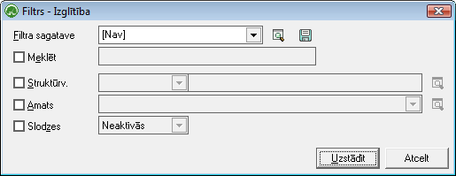
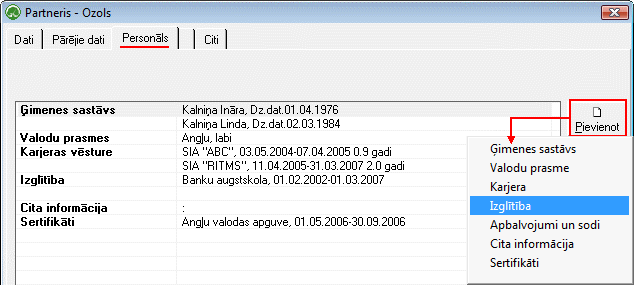
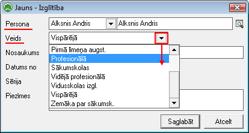

.. 763
 
Izglītība
*************
 

Izglītībasdokumentu žurnālā tiek saglabāti visi :doc:`Strādājošo<111>`
kartiņās pievienotie dati parizglītību.

Lai atlasītu dokumentus, jāizmanto datu atlases filtrs. Dati uz ekrāna
tiek parādīti atbilstoši norādītajiem datu atlases kritērijiem filtra
ekrāna formā. Rīku joslā nopiežot pogu |images_ozols/24535.gif|
(Ctrl+F), tiek atvērts filtra logs:

|images_ozols/26098.png|

Struktūrv. : Iespēja atlasīt informāciju par izglītību, konkrētā
struktūrvienībā strādājošajiem;

Amats :Iespēja atlasīt izglītības datusstrādājošiem pēc filtrāizvēlētā
Amata nosaukuma;

Slodzes: Dokumentu žurnālā iespējams atlasīt datus - informāciju par
Izglītībutikai Aktīvajām vai Neaktīvajām slodzēm.

Lai Dokumentu žurnālā datus atlasītu pēc izvēlētajiem datu atlases
kritērijiem, pēc filtra iestādījumu aizpildīšanas, jānospiež poga
|images_ozols/25944.png| .

Izglītībaspievienošana
++++++++++++++++++++++

JaunuIzglītības datuierakstu strādājošajam iespējams izveidot:

1. :doc:`Strādājošā aprakstā<111>` , sadāļā Personāls - iespēja
pievienotinformācijas par izglītību:

|images_ozols/25779.png|

2. Atrodoties :doc:`Izglītības dokumentu žurnālā<763>` un rīku
joslānospiežot pogu |images_ozols/24708.png| :

Izvēloties pievienot Izglītības datus, jāizvēlas slodze
(strādājošais), kuram šī informācija tiks pievienota:

|images_ozols/26099.png|

Nepieciešams norādīt atbilstošo veidu no saraksta, ievadīt Izglītības
iestādes nosaukumu, laika termiņu no...līdz, kā arī iespēja ievadīt
Izglītības dokumenta Sēriju un Nr.

Dati tiek saglabāti nospiežot pogu |images_ozols/25621.png| .

Pievienotie ierakstitiek saglabāti :doc:`Izglītības dokumentos<763>` .

.. |images_ozols/24535.gif| image:: images_ozols/24535.gif
       :scale: 100%

.. |images_ozols/25944.png| image:: images_ozols/25944.png
       :scale: 100%

.. |images_ozols/24708.png| image:: images_ozols/24708.png
       :scale: 100%

.. |images_ozols/25621.png| image:: images_ozols/25621.png
       :scale: 100%


 
