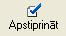

.. 820
 
Pamatlīdzekļu norakstīšanas dokuments (daļēji)
**************************************************
 

Pamatlīdzekļu dokuments paredzēts pamatlīdzekļu daļējai norakstīšanai.
Dokuments pēc saglabāšanas ir pieejams :doc:`Pamatlīdzekļu dokumentu
sarakstā<233>` .

|images_ozols/24545.gif| Pirms pamatlīdzekļu norakstīšanas
jāpārliecinās vai visiem daļēji norakstāmajiem pamatlīdzekļiem ir
aprēķināts nolietojums.

Pievienojot jaunu pamatlīdzekļu dokumentu jāizvēlas dokumenta veids
Pamatlīdzekļu norakstīšanas dokuments (daļēji) .

|images_ozols/25163.png|

Jāaizpilda dokumenta virsraksta dati:

Numurs - jānorāda pamatlīdzekļa dokumenta numurs. Šis numurs strādājot
ar sistēmu tiek piešķirts automātiski pēc iebūvētā
:doc:`numeratora<139>` . Visiem pamatlīdzekļu dokumentiem ir viena
numerācija.

Datums - pamatlīdzekļu dokumenta izveidošanas datums.

Paskaidrojums - jānorāda dokumenta paskaidrojums.Šī informācijatiek
rādīta pamatlīdzkļu uzskaites kartītē saimnieciskā darījuma aprakstā.

Piezīmes - iespējams norādīt piezīmes par dokumentu un šīs piezīmes
domātas tikai grāmatvedim. Pamatlīdzekļu atskaitēs šīs piezīmes netiek
uzrādītas.

Saglabāt - pēc dokumenta datu un pamatlīdzekļu(skat. zemāk Norakstāmo
pamatlīdzekļupievienošana Pamatlīdzekļu norakstīšanas dokumentam )
pievienošanas jāspiež šī komandpoga lai saglabātu izveidoto dokumentu.

Atcelt - ja lietotājs nevēlas saglabāt veiktās izmaiņas, jāspiež
komandpoga Atcelt.

|images_ozols/24545.gif| Lai izveidotā Pamatlīdzekļunorakstīšanas
dokumenta (daļēji) dati stātos spēkā obligāti pēc saglabāšanas
dokuments ir jāapstiprina ar funkciju |images_ozols/24715.JPG| .

|images_ozols/24545.gif| Pēc dokumenta apstiprināšanas Pamatlīdzekļu
norakstīšanasdokuments (daļēji) ir :doc:`jānogrāmato<14044>` .

Norakstāmo pamatlīdzekļupievienošana Pamatlīdzekļu norakstīšanas
dokumentam (daļēji)
+++++++++++++++++++

Pēc dokumenta datu aizpildīšanas ir jāaizpilda dati par daļēji
norakstāmajiem pamatlīdzekļiem. Dokumentam jaunu daļēji norakstāmo
pamatlīdzekli pievieno atvērtā Pamatlīdzekļunorakstīšanas dokumenta
(daļēji)formā ar funkciju |images_ozols/24708.png| .

Datus par daļēji norakstāmo pamatlīdzekli iespējams labot atvērtā
Pamatlīdzekļunorakstīšanas dokumenta (daļēji)formā ar funkciju
|images_ozols/24709.png| .

Pamatlīdzekli dzēš atvērtā Pamatlīdzekļunorakstīšanas dokumenta
(daļēji)formā ar funkciju |images_ozols/24719.JPG| .

|images_ozols/25164.png|

Pamatlīdzeklis - jānorāda no saraksta daļēji norakstāmais
pamatlīdzeklis.

Norakst.dok. - sistēma automatizēti norāda izvēlētā pamatlīdzekļa
stāšanas ekspluatācijā pamatlīdzekļu dokumentu. Šo dokumentu mainīt
nav nepieciešams.

Uzsk.v.norakstīt par:

Uzņēmuma - jānorāda pamatlīdzekļa norakstāmā uzskaites vērtība finanšu
vajadzībām.

Nodokļiem - jānorāda pamatlīdzekļa norakstāmā uzskaites vērtība
nodokļiem.

Nor.nol.par:

Uzņēmuma - jānorāda norakstāmais uzkrātais nolietojums finanšu
vajadzībām.

Nodokļiem - jānorāda norakstāmais uzkrātais nolietojums nodokļiem.

Piezīmes - iespējams norādīt piezīmes parnorakstāmo pamatlīdzekliun
šīs piezīmes domātas tikai grāmatvedim. Pamatlīdzekļu atskaitēs šīs
piezīmes netiek uzrādītas.

Saglabāt - jāspiež šī poga lai saglabātu ievadītos datus par daļēji
norakstāmo pamatlīdzekli.

Atcelt - jāspiež šī poga, ja lietotājs nevēlas saglabāt aizpildītos
datus par pamatlīdzekli.

.. |images_ozols/24545.gif| image:: images_ozols/24545.gif
       :scale: 100%

.. |images_ozols/24545.gif| image:: images_ozols/24545.gif
       :scale: 100%

.. |images_ozols/24545.gif| image:: images_ozols/24545.gif
       :scale: 100%

.. |images_ozols/24708.png| image:: images_ozols/24708.png
       :scale: 100%

.. |images_ozols/24709.png| image:: images_ozols/24709.png
       :scale: 100%

.. |images_ozols/24719.JPG| image:: images_ozols/24719.JPG
       :scale: 100%


 
