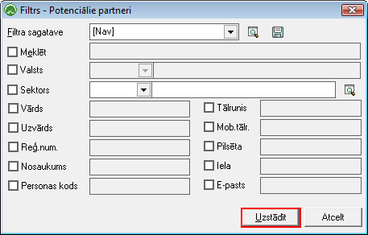

.. 842
 
Potenciālie partneri
************************
 

Sarakstā tieksaglabāti visi Ozols datu bāzē pievienotie uzņēmuma
:doc:`Potenciālais partner<884>` :doc:`i<312>` (gan fiziskas, gan
juridiskas personas).

Lai atlasītudatus Partnerussarakstā, jāizmanto datu atlases filtrs.
Dati uz ekrāna tiek parādīti atbilstoši norādītajiem datu atlases
kritērijiem filtra ekrāna formā. Filtru var uzlikt, lai ierobežotu
kādu datu parādīšanu uz ekrāna, iegūstot nepieciešamās izdrukas, vai
arī ātrāk sameklētu nepieciešamos datus. Filtrs tiek izmantots arī
atskaišu sagatavošanā un atsevišķu dokumentu satura aizpildīšanā.

Datu atlases kritērijus var saglabāt ( |images_ozols/24938.png| ).
Izvēloties izveidoto filtra sagatavi ( |images_ozols/24943.png| ),
filtrs tiek automatizēti aizpildīts no filtra sagataves. Lai izveidotu
atskaiti pēc vēlamajiem kritērijiem, Rīku joslā jānospiež poga
|images_ozols/24535.gif| (Ctrl+F), tiek atvērts filtra logs:

|images_ozols/25942.png|

.. |images_ozols/24938.png| image:: images_ozols/24938.png
       :scale: 100%

.. |images_ozols/24943.png| image:: images_ozols/24943.png
       :scale: 100%

.. |images_ozols/24535.gif| image:: images_ozols/24535.gif
       :scale: 100%


 
