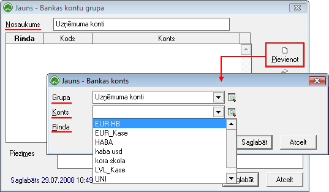
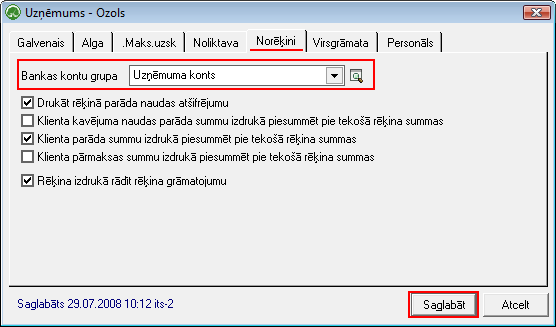

.. 857
 
Bankas kontu grupas
***********************
 


Sarakstā tiek saglabātas Bankas kontu grupas, kas tiek izmantotas
uzņēmumu rekvizītu attēlošanai :doc:`Pārdošanas dokumentos<304>` .
Bankas konta grupā iespējams piesaistīt neierobežotu skaitu uzņēmuma
rīcībā esošos :doc:`Banku kontus<141>` , kasnodrošina iespēju attēlot
šādu pašu skaitubankas kontus Pārdošanas dokumenta rekvizītu daļā.


JaunasBankas konta grupaspievienošana
`````````````````````````````````````

Lai pievienotu jaunuBankas kontu grupu,rīku joslā jānospiež poga..
image:: images_ozols/24708.png
:scale: 100%
un tiks atvērts jauns logs:



:scale: 100%


Nosaukums: Jāpiešķir bankas konta grupas nosaukums


Izmantojot pogu .. image:: images_ozols/24708.png
:scale: 100%
, bankas konta grupai nepieciešams piesaistīt atbilstošos
uzņēmuma:doc:` <141>` :doc:`Banku kontus<141>` , norādot bankas konta
attēlošanas secību :doc:`Pārdošanas dokumenta<304>` izdrukā (Rinda: 1,
2, 3,utt.)


Ieraksts tiks saglabāts, izpildot komandu .. image::
images_ozols/24710.png
:scale: 100%
.


.. image:: images_ozols/24545.gif
:scale: 100%
Lai Pārdošanas dokumenta izdrukā - uzņēmuma rekvizītu daļā,tiktu ņemti
dati no izveidotās bankas kontu grupas, pievienoto grupu nepieciešams
norādītKonfigurācija->Lietotāji->:doc:`Uzņēmumi<188>` ->Atvērt
uzņēmuma aprakstu un sadaļā: Norēķini->Norādīt izveidoto Bankas kontu
grupu:



:scale: 100%


Nospiežot pogu.. image:: images_ozols/24710.png
:scale: 100%
, dati tiks saglabāti un Pārdošanas dokumenta izdrukā, Pie pārdevēja
rekvizītiem tiks uzrādīti tie uzņēmuma bankas konti, kas pievienoti
norādītajai grupai.



 
