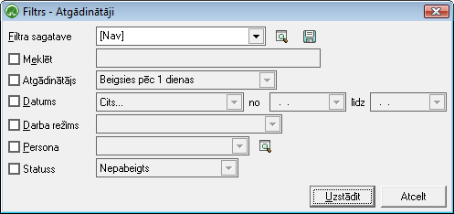

.. 874
 
Atgādinātāji
****************
 

Atgādinātāju žurnālātiek saglabāti visi sagatavotie :doc:`Atgādinājumu
ieraksti<875>` .

Lai atlasītu dokumentus, jāizmanto datu atlases filtrs. Dati uz ekrāna
tiek parādīti atbilstoši norādītajiem datu atlases kritērijiem filtra
ekrāna formā. Filtru var uzlikt, lai ierobežotu kādu datu parādīšanu
uz ekrāna, iegūstot nepieciešamās izdrukas, vai arī ātrāk sameklētu
nepieciešamos datus. Filtrs tiek izmantots arī atskaišu sagatavošanā
un atsevišķu dokumentu satura aizpildīšanā.

Datu atlases kritērijus var saglabāt ( |images_ozols/24938.png| ).
Izvēloties izveidoto filtra sagatavi ( |images_ozols/24943.png| ),
filtrs tiek automatizēti aizpildīts no filtra sagataves. Lai izveidotu
atskaiti pēc vēlamajiem kritērijiem, Rīku joslā jānospiež poga
|images_ozols/24535.gif| (Ctrl+F), tiek atvērts filtra logs:

|images_ozols/25943.png|

Datus iespējams atlasīt pēc:

Atgādinātājs : Termiņa, kad beigsies ievadītā aktivitātes termiņš

Datums : Atgādinājuma pievienošanas datuma

Darba režīms: Darba režīma, kuram šis atgādinājums ir pievienots (ar
ko atgādinātājs sasaistīts)

Persona : Atgādinājuma adresāts

Statuss : Pievienotā atgādinājuma statuss - vai atgādinājums ir
Pabeigts vai Nepabeigts

Lai Dokumentu žurnālā datus atlasītu pēc izvēlētajiem datu atlases
kritērijiem,pēc filtra iestādījumu aizpildīšanas,jānospiež poga
|images_ozols/25944.png| .

.. |images_ozols/24938.png| image:: images_ozols/24938.png
       :scale: 100%

.. |images_ozols/24943.png| image:: images_ozols/24943.png
       :scale: 100%

.. |images_ozols/24535.gif| image:: images_ozols/24535.gif
       :scale: 100%

.. |images_ozols/25944.png| image:: images_ozols/25944.png
       :scale: 100%


 
