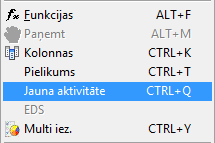
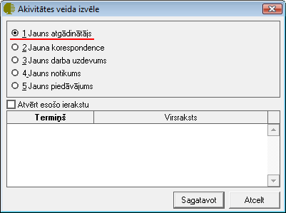
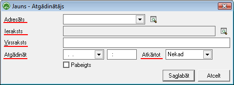

.. 875
 
Atgādinātājs
****************
 
Atgādinājums kalpo, lai atcerētos un piezīmētu kādas lietas, kuras ir
nepieciešams atgādināt. Šie atgādinātāji, kuri tiek ievadīti sistēmā,
tiek saglabāti un, nepieciešamības gadijumā, var tos atlasīt.
Attiecīgi iespējams zināt, kādi darbi sagaida dienas gaitā, vai arī
attiecīgajā :doc:`atlases kritērija periodā<874>` .

Atgādinātājus iespējams piesaistīt jebkuram dokumentam.

Jaunu Atgādinātāju iespējams izveidot:

1. Atrodoties :doc:`Atgādinātāju<874>` dokumentu žurnālā un rīku joslā
jānospiežot pogu .. image:: images_ozols/24708.png
:scale: 100%
;

2. No :doc:`Izvēlnes<14012>` Dati -> Jauna Aktivitāte:

:scale: 100%

3. No jebkura darba režīma, izmantojot taustiņu kombināciju CTRL+Q,
tiks atvērts jauns izvēlnes logs:

:scale: 100%

Izvēloties atbilstošo aktivitātes veidu un nospiežot pogu .. image::
images_ozols/25619.png
:scale: 100%
vai atrodoties kādā no žurnāliem un rīku joslā nospiežot pogu ..
image:: images_ozols/24708.png
:scale: 100%
, tiks atvērts jauns logs:

:scale: 100%

Adresāts: Izvēlnes laukā Adresāts ir jāliek no saraksta tā persona,
kurai atgādinājums būs domāts.

Ieraksts: Laukā Ieraksts būs redzams dokuments, par kuru ir taisīts
atgādinājums. Spiežot uz lupas pogu (.. image:: images_ozols/25928.png
:scale: 100%
) būs iespēja šo dokumentu atvērt.

Virsraksts: Laukā virsraksts ir jāraksta atgādinājuma teksts.
Informatīvs lauks - informācijai par ko atgādinājums tiek veidots.

Atgādināt: Izvēlnes laukā iespējams ielikt datumu, kurā atgādināt, un
pulksteņa laiku precīzi cikos nepieciešams atgādināt.

Atkārtot : Izvēlnes laukā atkārtot ir iespēja norādīt atgādinājuma
atkārtošanas periodu.

.. image:: images_ozols/24545.gif
:scale: 100%
Atgādinātājs tiek saglabāts, ja tiek aizpildīti obligātie lauki
adresāts, virsraksts un atgādinājuma datums.

Ja atgādinājums ir uzrakstīts un visi obligātie lauki aizpildīti, tad
spiežot pogu .. image:: images_ozols/25621.png
:scale: 100%
, atgādinājums tiek saglabāts sistēmā.

.. image:: images_ozols/24545.gif
:scale: 100%
Lai atgādinātāju "Izpildītu" (:doc:`statuss Izpildīts<843>` ), kad nav
nepieciešams turpināt atgādināt, jāieliek ķeksītis .. image::
images_ozols/26145.png
:scale: 100%
.


 
