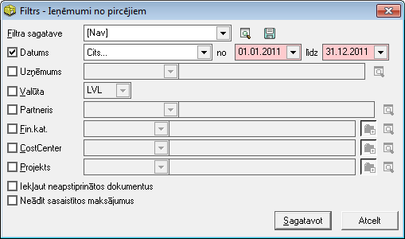
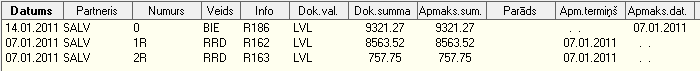

.. 950
 
Ieņēmumi no pircējiem
*************************
 
Atskaite tiek sagatavota, attēlojot bankas ieņēmumus un ar tiem
saistītos pārdošanas dokumentus.
Lai sagatavotu atskaiti, filtrā nepieciešams norādīt datu atlases
kritērijus.
Atskaiti var sagatavot atsevišķi par katru no partneriem, atlasīt
dokumentus pēc to veida, numura vai summas. Atskaiti var sagatavot:
- norādītajā laika periodā (datums);
- par vienu konkrētu partneri;
- pēc konkrētām dimensijām;
- valūtas;
- iekļaujot vai neiekļaujot neapstiprinātos dokumentus

|images_ozols/26560.png|

Atskaitē ir redzama informācija par bankas ieņēmumu un saistītajiem
pārdošanas dokumentiem, to datumiem:

|images_ozols/26561.png|

Atskaiti ir iespējams drukāt, nospiežot rīku joslā pogu
|images_ozols/25813.png| un izvēloties izdrukas formu.

.. |images_ozols/25813.png| image:: images_ozols/25813.png
       :scale: 100%


 
