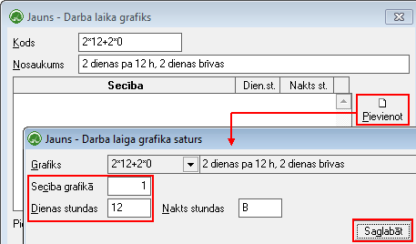
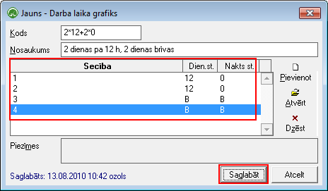

.. 984
 
Darba laiku grafiki
***********************
 
Darba laiku grafiki tiek izmantoti darba laika uzskaites tabeles
aizpildīšanai, lai aizpildīšanas procesu padarītu automatizētāku un
ērtāku.
Šajā darba režīmā iespējams pievienot neierobežotu skaitu darba laika
grafiku veidu, kurus tālāk varēs izmantot Tabeles aizpildīšanai
iOzolā.
Lai pievienotu jaunu Amata kvalifikācijas kategoriju, rīku joslā
jānospiež poga .. image:: images_ozols/25605.png
:scale: 100%
un jāaizpilda nepieciešamā informācija, ievadot darba laika grafika
kodu un nosaukumu:

:scale: 100%

Pēc tam nepieciešams aizpildīt darba laika grafika saturu, norādot
atbilstošo plānoto grafiku nedēļai, nospiežot pogu "Pievienot" ->
Norādot atbilstošo secību grafikā - piemēram, 1 (pirmā diena), stundu
skaits - 12 (12 stundas dienā) un saglabājot ierakstu:

:scale: 100%

Atbilstoši nepieciešams norādīt pilnu darba laika grafika ciklu
nedēļai, norādot atbilstošās dienas un nakts stundas katrai cikla
dienai - piemēram, cikls - 2 dienas stradā pa 12 stundām dienā un 2
dienas brīvas, izskatīsies šādi:

:scale: 100%

Ieraksts tiks saglabāts, izpildot komandu .. image::
images_ozols/24710.png
:scale: 100%
.


 
