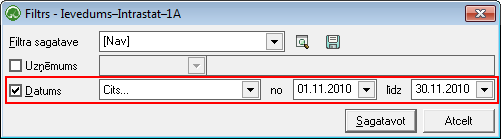
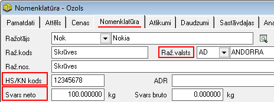
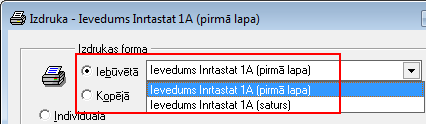

.. 990
 
Ievedums–Intrastat–1A
*************************
 

Ievedums-Instrastat-1A atskaitē tiek attēlota informācija par preces
ievedumu Latvijā no ES dalībvalsts - pamatojoties uz ievadītajiem
:doc:`Iepirkumu dokumenti<210>` , atskaitē norādot atbilstoši šo
:doc:`Iepirkuma dokumenta<310>` saturā minēto preču astoņu zīmju kodu,
preču vērtību latos, partnervalsti, svaru, darījuma veida kodu, svaru
un daudzumu papildmērvienībās.

Atskaite tiek sagatavota nonorēķinu - :doc:`Iepirkumu dokumentu<210>`
datiem.

Filtrs jāaizpilda, lai sagatavotu atskaiti.

Dati uz ekrāna tiek parādīti atbilstoši norādītajiem datu atlases
kritērijiem filtra ekrāna formā. Filtru var uzlikt, lai ierobežotu
kādu datu parādīšanu uz ekrāna, iegūstot nepieciešamās izdrukas, vai
arī ātrāk sameklētu nepieciešamos datus. Filtrs tiek izmantots arī
atskaišu sagatavošanā un atsevišķu dokumentu satura aizpildīšanā.

Pārskata Ievedums-Instrastat-1A sagatavošana

1. Izvēloties Noliktavas atskaiti - Ievedums-Intrastat-1A, tiks atvērt
filtra logs, kur jānorāda nepieciešamie parametri - laika periods, pēc
kādiem atskaite tiks sagatavota:

|images_ozols/26513.png|

2. Nospiežot pogu "Sagatavot" tiks sagatavota atskaite par izvēlēto
periodu:

|images_ozols/26514.png|

|images_ozols/24545.gif| Par pamatu atskaites informācijas
aizpildīšanai tiek izmantoti nomenklatūras aprakstā definētie kodi:

**KN kods:** preces 8-zīmju kods atbilstoši ES kombinētajai
nomenklatūrai - to iespējams norādīt :doc:`Nomenklatūras<106>`
aprakstā, sadaļā "Nomenklatūra"

**Izcel.valsts:** preces valsts, kur tā ražota - iespējams norādīt
:doc:`Nomenklatūras<106>` aprakstā, sadaļā "Nomenklatūra";

**Neto masa: **preces faktiskais svars bez iepakojuma izteikts kg un
noapaļots veselos skaitļos (norādāma :doc:`Nomenklatūras<106>`
aprakstā, sadaļā "Nomenklatūra"):

|images_ozols/26518.png|

|images_ozols/24545.gif| Kā arī pamatinformācija par saņemto preču
daudzumu un summām no :doc:`Iepirkuma dokumenta<310>` :

**Summa:** :doc:`Iepirkuma dokumenta<310>` saturā norādītā summa -
preces vērtība LVL, noapaļojot līdz veseliem latiem;

**Daudzums:** iepirktais preces daudzums;

**Nosūt.valsts:** valsts, no kuras prece nosūtīta (piegādātāja
aprakstā norādītās Valsts kods);

**Veids:** darījuma veids kods atbilstoši noteiktajai likumdošanai.

Sagatavoto atskaiti iespējams saglabāt :doc:`Intrastat atskaišu
sarakstā...<989>` :doc:`<531>` , kur tā būs pieejama
labošanai/drukāšanai, nospiežot pogu: |images_ozols/25054.png| .

Nospiežot pogu |images_ozols/24617.jpg| atskaite sagatavota netiks un
darbība tiks atcelta. Ja atskaite tiek izveidota un nav jāsaglabā,
jālieto komanda Atcelt . Ja atskaite ir saglabāta sarakstā, komandu
Atcelt var izmantot, lai nesaglabātu atskaitē veiktās izmaiņas.

|images_ozols/24545.gif| Sagatavotu atskaiti ir iespējams, rīku joslā
nospiežot pogu |images_ozols/25813.png| un izvēloties atbilstošo
izdrukas formu (pieejamas 2 izdrukas formas - atskaites Virsraksta un
Satura informācijas drukāšanai):

|images_ozols/26517.png|

.. |images_ozols/26514.png| image:: images_ozols/26514.png
       :scale: 100%

.. |images_ozols/24545.gif| image:: images_ozols/24545.gif
       :scale: 100%

.. |images_ozols/24545.gif| image:: images_ozols/24545.gif
       :scale: 100%

.. |images_ozols/25054.png| image:: images_ozols/25054.png
       :scale: 100%

.. |images_ozols/24617.jpg| image:: images_ozols/24617.jpg
       :scale: 100%

.. |images_ozols/24545.gif| image:: images_ozols/24545.gif
       :scale: 100%


 
