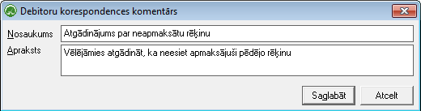

.. 991
 
Debitoru korespondences komentāri
*************************************
 


Sarakstā tiek saglabāti debitoru korespondences komentāri -
paskaidrojumu teksti, kas tiek izmantoti Debitoru korespondences
uzturēšanai, izmantojot CRM funkcionalitāti - pievienojot komentārus
atskaitē :doc:`Pircēju parādi<555>` .


Jauna debitoru korespondences komentāra pievienošana

Lai pievienotu jaunu komentāra tekstu, jāizmanto komanda
|images_ozols/24879.png| no rīku joslas (Alt+P) un tiks atvērts jauns
logs:


|images_ozols/26506.png|


**Nosaukums: **nepieciešams ierakstīt jaunizveidotā korespondences
komentāra nosaukums;

**Apraksts: **iespēja ievadīt īsu komentāra aprakstu - paskaidrojošo
informāciju.


Jaunizveidotais ieraksts tiks saglabāts, izmantojot komandu
|images_ozols/24867.png| no rīku joslas vai (Ctrl+S) vai atcelts , ja
tiks izmantota komanda |images_ozols/24617.jpg| .


Debitoru korespondences komentāra ieraksta labošana
```````````````````````````````````````````````````

Lai veiktu labojumus komentāra ierakstā, to nepieciešams atvērt,
izmantojot komandu |images_ozols/24869.png| no rīku joslas (Alt+A).
Atvērtajā logā iespējams mainīt nosaukumu. Pēc labojumu veikšanas,
veiktās izmaiņas iespējams saglabāt ar komandu
|images_ozols/24867.png| no rīku joslas.


Ieraksta dzēšana
````````````````

Lai dzēstu ierakstu, jāizmanto komanda |images_ozols/25602.png| no
rīku joslas. Ieraksts ir jādzēš neatvērtā veidā.

.. |images_ozols/24879.png| image:: images_ozols/24879.png
       :scale: 100%



.. |images_ozols/24867.png| image:: images_ozols/24867.png
       :scale: 100%

.. |images_ozols/24617.jpg| image:: images_ozols/24617.jpg
       :scale: 100%

.. |images_ozols/24869.png| image:: images_ozols/24869.png
       :scale: 100%

.. |images_ozols/24867.png| image:: images_ozols/24867.png
       :scale: 100%

.. |images_ozols/25602.png| image:: images_ozols/25602.png
       :scale: 100%


 
